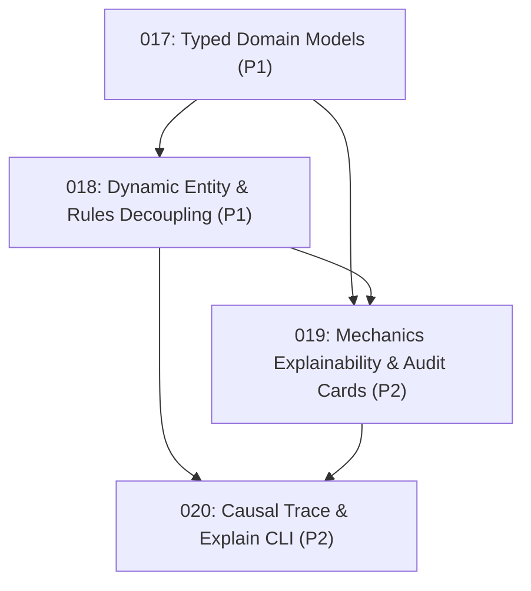

# Agentic D&D Implementation & Improvement Plans

This directory contains self-contained, prioritized handoff plans generated during codebase audit and architectural analysis. Each plan is designed to be executed by autonomous coding agents or human developers with clear verification gates.

---

## Plan Status & Execution Index

| Plan | Title | Category | Priority | Effort | Risk | Dependencies | Status |
|---|---|---|---|---|---|---|---|
| [001](001-fix-rollback-relationships-state.md) | **Fix StateManager save_relationships for Rollback Integrity** | Bug / Correctness | **P1** | **S** (<1h) | LOW | None | `DONE` |
| [002](002-path-traversal-containment-security.md) | **Implement Path Traversal Containment Security** | Security | **P1** | **S** (1-2h) | LOW | None | `DONE` |
| [003](003-orchestrator-spellcasting-resting-routing.md) | **Natural Language Spellcasting and Resting Routing in Orchestrator** | Architecture / Feature | **P1** | **M** (1d) | MED | None | `DONE` |
| [004](004-dynamic-entity-resolution-rules-agent.md) | **Dynamic Entity and Weapon Resolution in Rules Agent** | Tech Debt / Architecture | **P2** | **S–M** (0.5d) | LOW | None | `DONE` |
| [005](005-modernize-repl-cli.md) | **Modernize Interactive REPL in cli.py** | Tech Debt / DX | **P2** | **S** (1h) | LOW | None | `DONE` |
| [006](006-zone-based-spatial-combat-engine.md) | **Design & Spike: Zone-Based Spatial Combat Engine** | Product Direction | **P3** | **M** (1-2d) | LOW | None | `DONE` |
| [007](007-5e-loot-treasure-generator.md) | **Deterministic 5e Loot & Treasure Hoard Generator** | Product Direction | **P3** | **S** (0.5d) | LOW | None | `DONE` |
| [008](008-compendium-schema-validator-linter.md) | **Compendium Schema Validator & Homebrew Linter** | DX / Tooling | **P1** | **S** (1-2h) | LOW | None | `DONE` |
| [009](009-adventure-package-scaffolder.md) | **Modular Adventure Package Scaffolder** | DX / Feature | **P1** | **S** (1-2h) | LOW | None | `DONE` |
| [010](010-action-error-recovery-suggestions.md) | **Action Error Recovery and Fuzzy Suggestions** | UX / Error Recovery | **P2** | **S** (1-2h) | LOW | None | `DONE` |
| [011](011-visual-state-diff-cards.md) | **Visual Before/After State Diff Cards** | UX / DX | **P2** | **S** (1h) | LOW | None | `DONE` |
| [012](012-turn-mini-hud-condition-badges.md) | **In-Turn Mini-HUD and Tactical Condition Badges** | UX / Immersion | **P2** | **S** (1h) | LOW | None | `DONE` |
| [013](013-unified-compendium-adventure-overlay.md) | **Unified Multi-Tier Compendium & Asset Overlay** | Architecture / Compendium | **P1** | **S** (1-2h) | LOW | None | `DONE` |
| [014](014-adventure-state-synchronization.md) | **Full Adventure Lifecycle State Synchronization** | Persistence / State | **P1** | **S** (1h) | LOW | 013 | `DONE` |
| [015](015-adventure-encounter-preset-calculator.md) | **Adventure-Aware Encounter & Preset Calculator** | Combat / Encounters | **P2** | **S** (1h) | LOW | 013, 014 | `DONE` |
| [016](016-adventure-relic-loot-generator.md) | **Adventure-Specific Relic Drops in Loot Generator** | Loot / Rewards | **P2** | **S** (1h) | LOW | 013, 014 | `DONE` |
| [017](017-typed-domain-models-schema-contracts.md) | **Typed Domain Models and Explicit Schema Contracts** | Tech Debt / Architecture | **P1** | **M** (0.5d) | LOW | None | `DONE` |
| [018](018-dynamic-entity-context-rules-decoupling.md) | **Dynamic Entity Context & Rules Agent Decoupling** | Tech Debt / Architecture | **P1** | **S** (1-2h) | LOW | 017 | `DONE` |
| [019](019-mechanics-explainability-dc-damage-audit-cards.md) | **Mechanics Explainability, DC Formulas & Damage Audit Cards** | UX / Explainability | **P2** | **S** (1-2h) | LOW | 017, 018 | `DONE` |
| [020](020-orchestrator-causal-trace-and-explain-cli.md) | **Orchestrator Causal Execution Graph & CLI Explain Command** | DX / Tooling | **P2** | **S–M** (0.5d) | LOW | 018, 019 | `DONE` |

---

## Dependency Graph & Recommended Execution Order



### Recommended Phases

1. **Phase 1 (Critical Stability, Security & Foundational Engine — Plans 001–007)**: `DONE`
2. **Phase 2 (Developer & Modder DX — Plans 008–009)**: `DONE`
3. **Phase 3 (Player Immersion & Visual UX — Plans 010–012)**: `DONE`
4. **Phase 4 (Core & Adventure Information Unification — Plans 013–016)**: `DONE`
5. **Phase 5 (Architecture De-ambiguation & Full Explainability — Plans 017–020)**: `DONE`

---

## Universal Verification Gate

After executing any plan, run the full verification command:
```bash
python dnd.py test
```
All tests must pass (138+ tests) with exit code 0 before marking a plan `DONE`.
